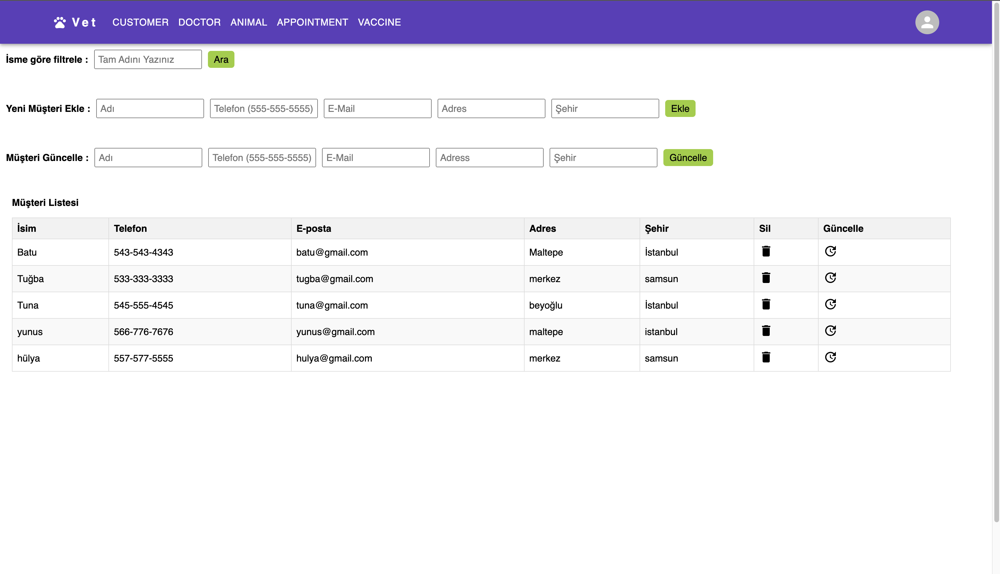

# Veterinary App

- This project is a system that simulates the management of daily operations of veterinary clinics. It includes basic features such as recording animal and owner information, vaccine management, appointment creation and doctor management, and management of doctors available days.The UML diagram of the project has been added as a jpg file.
- **[Live Project Link](https://vetapp-frontend-eight.vercel.app/)** - Click here to access the live project of the Veterinary App.
- _[API Endpoints Explanation](https://github.com/nidaonder/VetManagementSystem.git)_ - Click here for detailed explanations about the API endpoints.

## Technologies

* Programming Language, JavaScript
* Library, React
* Development Environment, Vite
* Database (For Backend), PostgreSQL

